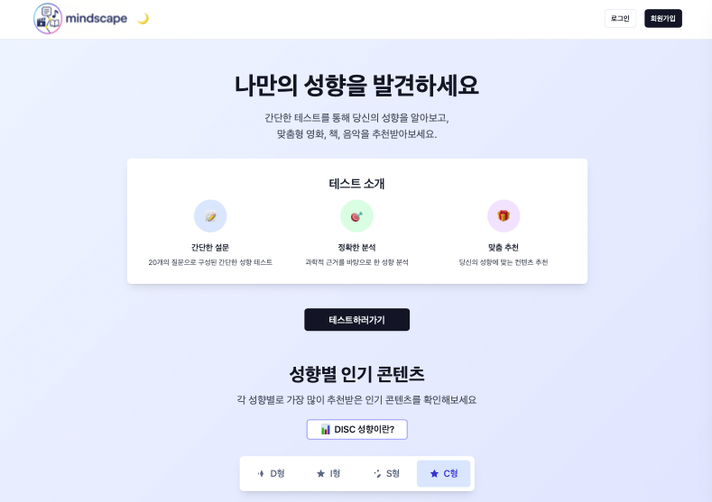
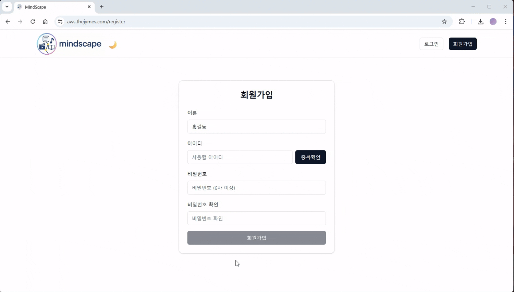
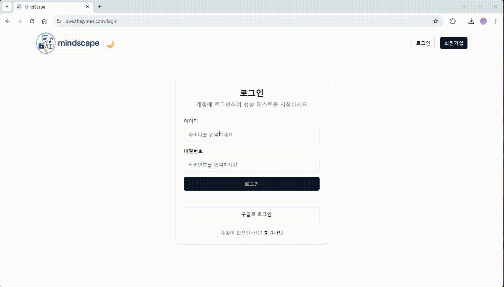
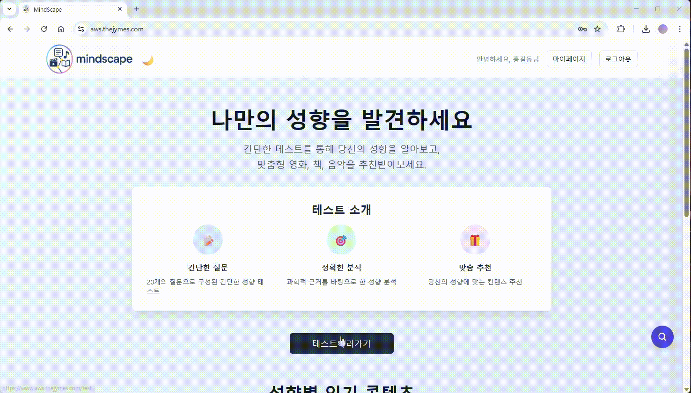
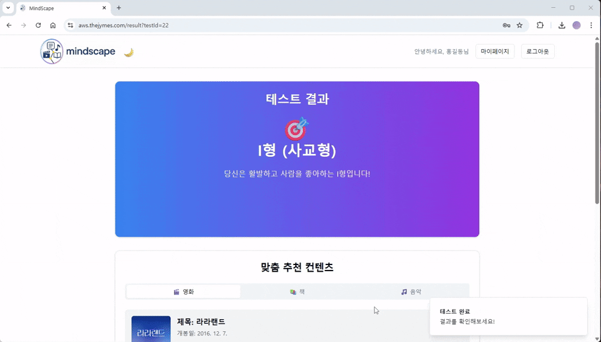
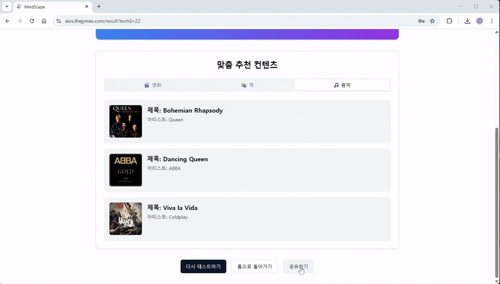
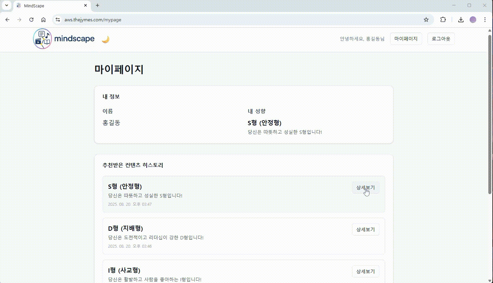
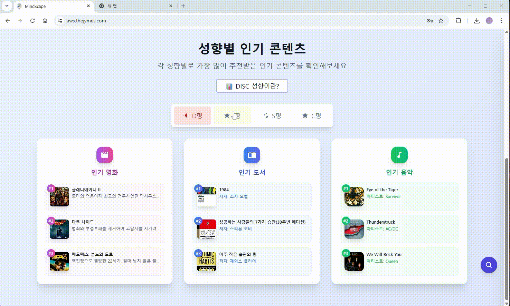
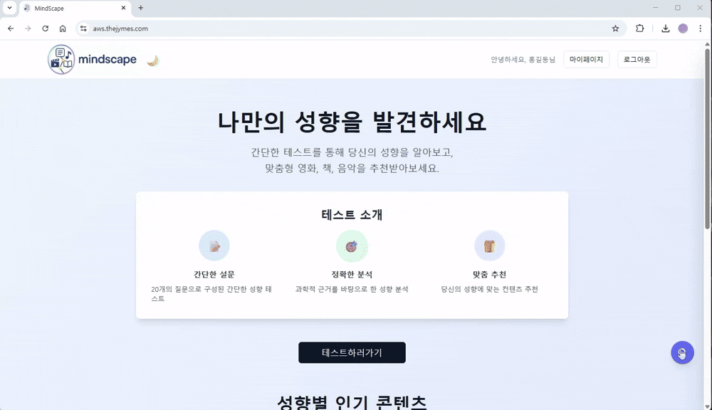
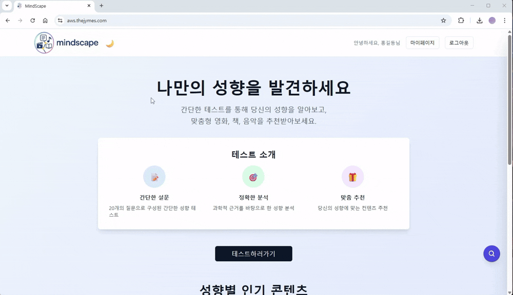

# 🌙 MindScape

  

### 🎯 성향으로 연결되는 콘텐츠 추천의 시작

  <b>MindScape</b>는 사용자의 성향을 분석하여 영화, 음악, 책 등 맞춤형 콘텐츠를 추천하는 성향 기반 콘텐츠 추천 플랫폼입니다. 
  간단한 DISC 테스트를 통해 성향을 파악하고, 유형별로 최적화된 콘텐츠를 제공합니다.  
  <b> 제작 기간:</b> 2025/07/16 ~ 2025/08/21

 
## 👥 팀원 구성 및 역할
<table>
  <tr>
    <th width="200">문지현 팀장</th>
    <th width="200">백주희 부팀장</th>
    <th width="200">김종훈 팀원</th>
  </tr>
  <tr>
    <td align="center">
      <a href="https://github.com/door-JH">
         
      </a>
       
      역할1 
      역할2 
      역할3
    </td>
    <td align="center">
      <a href="https://github.com/ju0204">
         
      </a>
       
      역할1 
      역할2 
      역할3
    </td>
    <td align="center">
      <a href="https://github.com/yhy0009">
         
      </a>
       
      역할1 
      역할2 
      역할3
    </td>
  </tr>
  <tr>
    <th width="200">장민지 팀원</th>
    <th width="200">정영민 팀원</th>
    <th width="200">이예지 팀원</th>
  </tr>
  <tr>
    <td align="center">
      <a href="https://github.com/rossenzii">
         
      </a>
       
      역할1 
      역할2 
      역할3
    </td>
    <td align="center">
      <a href="https://github.com/jyoungmin-com">
         
      </a>
       
      역할1 
      역할2 
      역할3
    </td>
    <td align="center">
      <a href="https://github.com/yejipo">
         
      </a>
       
      역할1 
      역할2 
      역할3
    </td>
  </tr>
</table>

 

## 🛠 기술 스택

| 구분               | 기술 스택 |
|--------------------|-----------|
| **⚙️ 운영 도구**     | Termius, STS (Spring Tool Suite), Visual Studio Code, Intellij IDEA, Cursor |
| **💻 백엔드**        | Java 17, Spring Boot 3, Spring Data JPA, Maven |
| **☁️ 인프라**        | AWS, Terraform |
| **🐳 컨테이너 / 배포** | Docker, Kubernetes, Helm, ArgoCD |
| **🔄 CI/CD & GitOps** | GitHub Actions, ArgoCD |
| **📊 모니터링 / 테스트** | Prometheus, Grafana, k6, Loki, Promtail |

 

## 앱 주요 기능

## 1. 회원가입 · 로그인 

  
  

- 회원가입시 중복 아이디 방지를 위한 중복 확인 기능 추가했습니다.
- 중복 확인 검사가 통과 되어야만 회원가입 버튼이 활성화 됩니다.
- 구글 아이디로 로그인이 가능합니다.
  
   
## 2. DISC 테스트 

  
  

 

- 사용자는 DISC 테스트 검사를 진행하고
- 결과 확인하러가기 버튼을 눌러 결과 페이지로 이동합니다.

## 3. 결과페이지

- DISC 테스트 결과에 따라 분석된 성향 유형과 그에 맞는 콘텐츠 추천 리스트를 보여줍니다.
- 영화, 책, 음악 콘텐츠를 유형별로 분류하여 제공합니다.

## 4. 공유

  

- 테스트 결과를 링크로 공유하여 외부에서 해당 결과를 확인할 수 있습니다.

## 5.마이페이지

  

- 내가 테스트를 통해 추천받은 영화, 책, 음악 등의 콘텐츠 이력을 한눈에 확인할 수 있습니다.
- 유형별 히스토리와 나의 취향 데이터를 기반으로 개인화된 기록을 제공합니다.

## 6. 인기컨텐츠

 

- 유형별로 유저들이 가장 많이 추천한 인기 콘텐츠를 확인할 수 있습니다.
- DISC 성향에 따라 어떤 콘텐츠가 많이 선택되었는지 시각적으로 확인할 수 있습니다.

## 7. 검색

  

- 사용자가 테스트 추천 외에도 원하는 콘텐츠를 자유롭게 탐색할 수 있도록 지원합니다.
- 사용자는 원하는 콘텐츠(책, 영화, 음악 등)를 직접 검색할 수 있는 기능을 사용할 수 있습니다.
- 외부 API(TMDB, Kakao Books, Last.fm 등)를 연동해 검색 결과를 가져옵니
- 검색 결과는 카드 형식으로 보여주며, 각 콘텐츠에 대한 상세 정보까지 확인 가능합니다.
 

## 8. dark 모드

  
  
- 사용자가 테마를 선택해서 눈에 편한 화면 제공받을 수 있도록 합니다.
- 모든 페이지에서 라이트 모드일 때는 기존 디자인이 유지되며, 다크 모드일 때만 배경·텍스트·카드 색상이 어둡게 변경됩니다.
- 해당 설정은 페이지를 나갔다 와도 유지됩니다.
- TailwindCSS `dark:` prefix 활용 

