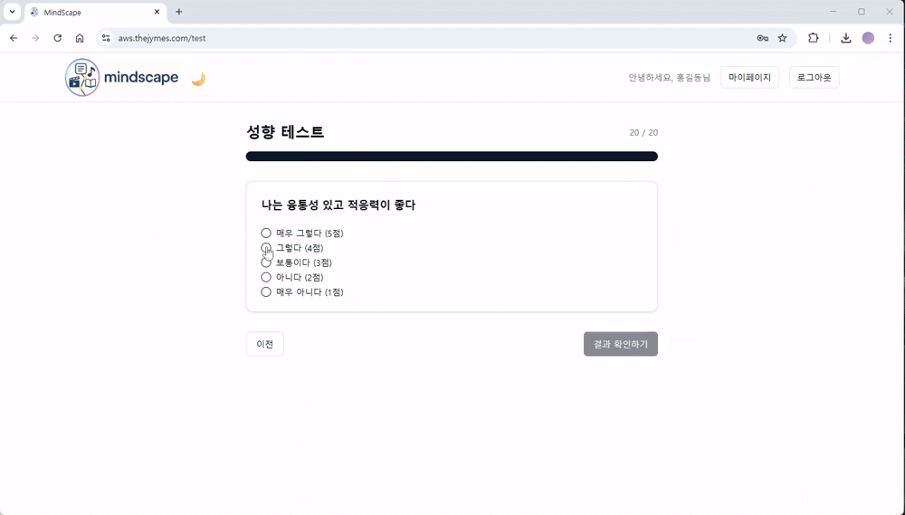
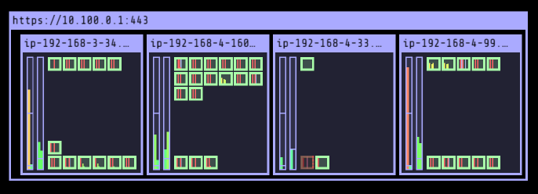
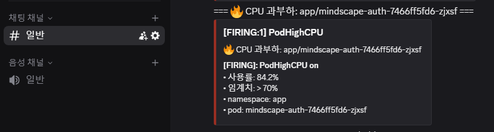
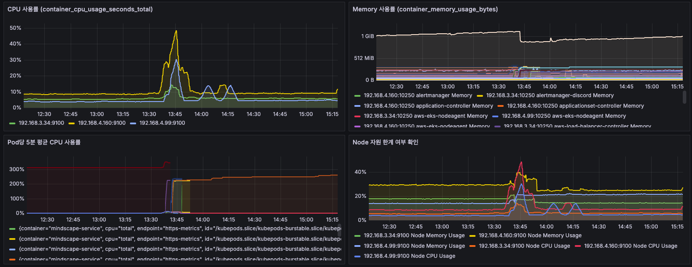
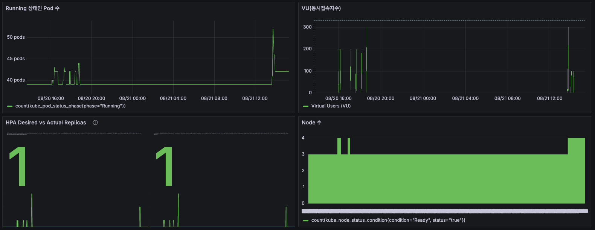
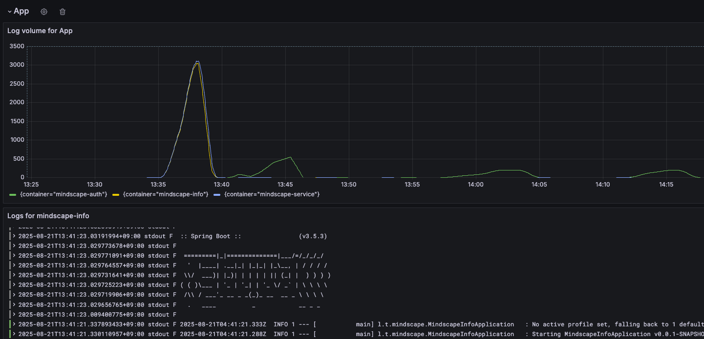
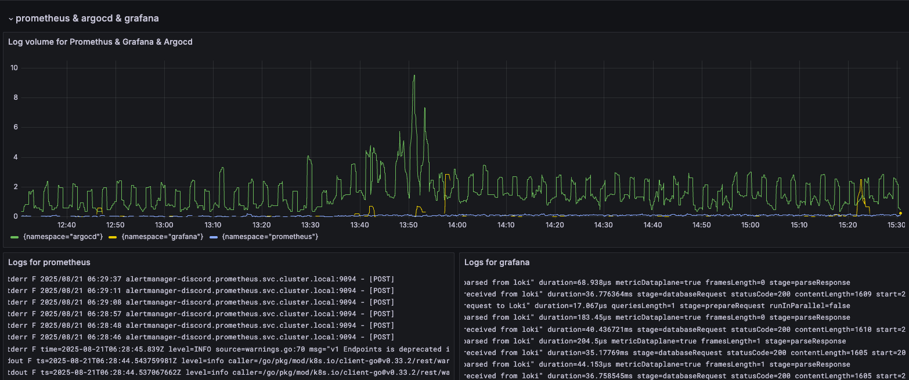

# 🌙 MindScape

  

### 🎯 성향으로 연결되는 콘텐츠 추천의 시작

  <b>MindScape</b>는 사용자의 성향을 분석하여 영화, 음악, 책 등 맞춤형 콘텐츠를 추천하는 성향 기반 콘텐츠 추천 플랫폼입니다. 
  간단한 DISC 테스트를 통해 성향을 파악하고, 유형별로 최적화된 콘텐츠를 제공합니다.  
  <b> 제작 기간:</b> 2025/07/16 ~ 2025/08/21  
  <b> Backend GitHub:</b> https://github.com/CLD-3rd/Final-Team1-Backend.git  
  <b> Frontend GitHub:</b> https://github.com/CLD-3rd/Final-Team1-Frontend.git

  

## 1️⃣ 팀원 구성 및 역할
<table>
  <tr>
    <th width="200">문지현 팀장</th>
    <th width="200">백주희 부팀장</th>
    <th width="200">김종훈 팀원</th>
  </tr>
  <tr>
    <td align="center">
      <a href="https://github.com/door-JH">
         
      </a>
       
       Frontend infra  
       Log  
       Auth server  
       회원가입 페이지 
       로그인 페이지 
       공유
    </td>
    <td align="center">
      <a href="https://github.com/ju0204">
         
      </a>
       
      Backend infra 
      Argocd 
      Alert 
      Hpa, Karpenter 
      Service server 
      결과페이지 
      마이페이지 
    </td>
    <td align="center">
      <a href="https://github.com/yhy0009">
         
      </a>
       
      Backend infra 
      Argocd 
      Hpa 
      Info server 
      결과 페이지 
      테스트 페이지 
      인기 컨텐츠 
    </td>
  </tr>
  <tr>
    <th width="200">장민지 팀원</th>
    <th width="200">정영민 팀원</th>
    <th width="200">이예지 팀원</th>
  </tr>
  <tr>
    <td align="center">
      <a href="https://github.com/rossenzii">
         
      </a>
       
      Backend Terraform 
      Argocd 
      Cicd 
      Promtail/Loki 
      Grafana 
      Service server 
    </td>
    <td align="center">
      <a href="https://github.com/jyoungmin-com">
         
      </a>
       
      Frontend infra  
      Grafana 
      K6 
      Service server 
      인기 컨텐츠 
    </td>
    <td align="center">
      <a href="https://github.com/yejipo">
         
      </a>
       
      Backend Terraform 
      Grafana 
      Info server 
      검색 
      Dark 모드  
    </td>
  </tr>
</table>

  

## 2️⃣ 기술 스택

| 구분               | 기술 스택 |
|--------------------|-----------|
| 운영 도구     | Termius, STS (Spring Tool Suite), Visual Studio Code, Intellij IDEA, Cursor |
| 백엔드        | Java 17, Spring Boot 3, Spring Data JPA, Maven |
| 인프라        | AWS, Terraform |
| 컨테이너 / 배포 | Docker, Kubernetes, Helm, ArgoCD |
| CI/CD & GitOps | GitHub Actions, ArgoCD |
| 모니터링 / 테스트 | Prometheus, Grafana, k6, Loki, Promtail, InfluxDB, Discord |
| 협업 툴 | Discord, Gather |

  

## 3️⃣ 앱 주요 기능

### 1. 회원가입 · 로그인 

  
  

- 회원가입시 중복 아이디 방지를 위한 중복 확인 기능 추가했습니다.
- 중복 확인 검사가 통과 되어야만 회원가입 버튼이 활성화 됩니다.
- Spring Security 기반 Stateless JWT 인증 시스템을 도입하고 구글 소셜 로그인 구현하였습니다.
  
 
### 2. DISC 테스트 

  
  

 

- 사용자는 DISC 테스트 검사를 진행합니다.
- 답변 선택 시 페이지가 이동되도록 React Router를 활용한 client-side routing을 구현하였습니다.
- 결과 확인하러가기 버튼을 눌러 결과 페이지로 이동합니다.

### 3. 결과페이지

- DISC 테스트 결과에 따라 분석된 성향 유형과 그에 맞는 콘텐츠 추천 리스트를 보여줍니다.
- 영화, 책, 음악 콘텐츠를 유형별로 분류하여 제공합니다.
- 추천 결과를 redis에 저장하고 히스토리 열람을 위해 AOF 기능을 사용하였습니다.

### 4. 공유

  

- 테스트 결과를 링크로 공유하여 외부에서 해당 결과를 확인할 수 있습니다.
- 사용자별 추천 결과를 url에 매핑하여 외부에서 접근하도록 동적 라우팅 기반 공유 기능을 구현하였습니다.

### 5.마이페이지

  

- 유저가 테스트를 통해 추천받은 영화, 책, 음악 등의 콘텐츠 이력을 한눈에 확인할 수 있습니다.
- 유형별 히스토리와 나의 취향 데이터를 기반으로 개인화된 기록을 제공합니다.

### 6. 인기컨텐츠

 

- DISC 유형별로 유저들이 많이 추천받은 인기 콘텐츠를 확인할 수 있습니다.
- 모든 사용자의 추천 기록을 기반으로 콘텐츠별 추천 횟수를 집계하고, DB에서 이를 내림차순 정렬하여 인기 콘텐츠를 조회합니다.

### 7. 검색

  

- 사용자는 테스트 추천 외에도 원하는 콘텐츠(책, 영화, 음악 등)를 직접 검색할 수 있는 기능을 사용할 수 있습니다.
- 외부 API(TMDB, Kakao Books, Last.fm 등)를 연동해 검색 결과를 가져옵니다.
- 검색 결과는 카드 형식으로 보여주며, 각 콘텐츠에 대한 상세 정보까지 확인 가능합니다.
 

### 8. dark 모드

  
  

- 모든 페이지에서 라이트 모드일 때는 기존 디자인이 유지되며, 다크 모드일 때만 배경·텍스트·카드 색상이 어둡게 변경됩니다.
- TailwindCSS `dark:` prefix 활용해 다크모를 적용했습니다.

  
## 4️⃣ 아키텍처

  

- Terraform으로 AWS 인프라(VPC, EKS, RDS 등)를 구성하고 Terraform Helm provider로 Prometheus·Grafana·ArgoCD를 배포했으며, Karpenter 설치와 IRSA/IAM 기반 인증·권한 설정까지 포함했습니다.
- GitHub Actions와 Argo CD로 MSA를 자동 배포했으며, ALB Controller, ingress는 Argo CD의 yaml로 설치·관리했습니다.
- InfluxDB, Prometheus, Loki와 Discord 알림을 활용해 로그 및 모니터링 시스템을 구축했습니다.

## 5️⃣ Auto Scaling (Pods ↔ Nodes) & Alert

  
  

#### Pod 오토스케일링 (HPA)
- 워크로드의 CPU/메모리(필요 시 커스텀 메트릭) 기준으로 **Replica 수 자동 조절**.
- 예) CPU 60% 초과 시 스케일아웃, 내려가면 스케일인.

#### 노드 오토스케일링 (Karpenter)
- HPA가 파드를 늘려 **Pending**이 생기면 요구사항(리소스/taint/affinity)에 맞는 **노드를 즉시 프로비저닝**.
- 부하가 줄어 **유휴 노드**가 생기면 **consolidation/TTL** 정책으로 **노드 축소**.

#### 동작 흐름
1) 부하 ↑ → **HPA 파드 증가** → Pending 발생 → **Karpenter 노드 생성** → 트래픽 처리  
2) 부하 ↓ → **HPA 파드 감소** → 유휴 노드 발생 → **Karpenter 노드 회수**

#### Alert
- **CPU 사용률이 70% 이상**으로 상승(예: 5분 지속)하면 **Discord**로 알림 전송.

  
## 6️⃣ Argocd

- <b> MSA:</b> 각 마이크로서비스를 Kubernetes Deployment로 구성하고, Argo CD(GitOps)로 배포/관리합니다.  
- <b> Ingress:</b> 단일 Publicc ALB로 경로 기반 라우팅합니다.

  
## 7️⃣ Grafana

|  **cpu, memory 사용률, node 자원 한계**  |  **과부하 테스트**  |
|---|---|
|  |  |

|  **MSA 서비스별 로그**  |  **Prometheus & Argo CD 로그**  |
|---|---|
|   |   |

  
##  K6
K6로 두 가지 시나리오를 검증합니다: 과부하 테스트(HPA 자동 확장·안정성)와 MSA 테스트(서비스별 성능: 응답시간·에러율·RPS).

|과부하 테스트 | msa 테스트 |
| :-------| :-------|
|||
|✅ 총 120개의 요청이 문제없이 처리됨    - 평균 요청 처리 시간 : 82.09 ms    - HPA Replica 수:    |✅ 총 4002개의 요청이 문제없이 처리됨  - auth server 응답 평균시간 : 7.74s    - info server 응답 평균시간: 21.9s    - Service server 응답 평균시간 : 18.28s   - 95th 퍼센타일 : 14.95s|

## 테스트 결과
